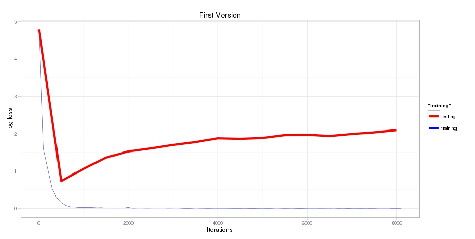

# Experimenting with Caffe
A short tutorial how to create a classifier from images.

## Creating the images (prerequisite)
In this repository there images but they are stored in a single, so in the first step we create the directories and convert the images to pngs.

```
dueo@srv-lab-t-706:~/dl-playground/python/imageUtils$ ./mkdirs.sh 
dueo@srv-lab-t-706:~/dl-playground/python/imageUtils$ python CreateImages.py 
```
In the data directory, you should find a subfolder with two batches, of 48x48 images like the one below.


## Creating the lists of images
We have two batches of images (batch1 indoor, batch2 taken outdoors). We use batch2 to test the performance and we split batch1 in two parts, one to train the classifier and the other one to evaluate the performance (also called testset in the caffe). Caffe works on data-layes, these can come from a database (see later) or they can come from lists of files (see below). We create the lists of files using the following 2 commands.
```
  ~/dl-playground/python/FaceCaffe$ python ../imageUtils/CreateLists.py /home/dueo/dl-playground/data/images/batch1/ names2Numbers.txt batch1_ 0.80
  ~/dl-playground/python/FaceCaffe$ python ../imageUtils/CreateLists.py /home/dueo/dl-playground/data/images/batch2/ names2Numbers.txt batch2_ 1000.0
```
The last entry (0.8, 10000) determines the fraction of the training-set. So from batch1 80% is for training and 20% for testing. In batch 2 we only have one set, which we will use for validation later on. The first lines of batch1_train.txt are:
```
/home/dueo/dl-playground/data/images/batch1/Martin/107.png 2
/home/dueo/dl-playground/data/images/batch1/Rebekka/230.png 4
/home/dueo/dl-playground/data/images/batch1/Martin/137.png 2
/home/dueo/dl-playground/data/images/batch1/Martin/136.png 2
/home/dueo/dl-playground/data/images/batch1/Rebekka/203.png 4
/home/dueo/dl-playground/data/images/batch1/Oliver/154.png 3
/home/dueo/dl-playground/data/images/batch1/Ruedi/281.png 5
/home/dueo/dl-playground/data/images/batch1/Ruedi/255.png 5
/home/dueo/dl-playground/data/images/batch1/Dejan/40.png 0
```
Note that the script ```CreateLists.py``` does a random shuffling. If we would not do this random shuffeling it could be that only images of on person are in a particular mini-batch of the training set.


## Defining the model. 
A model is defined by chaining different layers like convolution layer, max-pooling layer, together. For the different layers see the [tutorial](http://caffe.berkeleyvision.org/tutorial/layers.html#data-layers) or [use the source luke](https://github.com/BVLC/caffe/tree/master/src/caffe/layers). 

We want to build the following architecture:


In the first convolutional layer 20 kernels of size 5×5 were applied re- sulting in 20 42×42 “images” (C1) from which the maxi- mum of 3×3 neighboring pixels were taken (maxpooling, S2). As a next step, the results were fed into the second convolutional layer (C3)using 100 5×5 filters. Next, a max- pooling (S4) 2×2 was done resulting in 100 5×5 images. These 2500 pixels were then taken as an input for a fully connected hidden layer (H5) with an output of 200 neurons, which was then fed into a multinomial logistic regression with 6 outputs representing the 6 persons.

The model is defined in [prototxt](model/letnet_train_test_files.prototxt)
We begin with the data-layer defined in the model

### The data layer
```
layers {
  name: "Egal"
  type: IMAGE_DATA
  top: "data"
  top: "label"
  image_data_param {
    source: "../batch1_train.txt"
    batch_size: 256
    #shuffle: true
    #new_height: 50
    #new_width: 50
  }
  transform_param {
    scale: 0.00390625  # Image is [0,1] then
    #mirror: 0         # We do not do random rotation, the faces are 
    crop_size: 46      # We randomly crop 46x46
  }
  include: { phase: TRAIN } #These rules apply in the training-phase
}
```

### The other layers
**TODO**

### The output layers (log-loss)
```

```


## Training the model
The model could be trained with the following command
```
nohup ~/caffe/caffe/build/tools/caffe train -solver lenet_solver.prototxt -gpu=0 > log_lenet.txt &
```

### The convergence
Using the R-Script [PlotTraining](PlotTraining.R) the log-loss caluclated in the output layer can be investigated. We see a text book like overfitting.


## Inspecting the traing model
We don't care about the overfitting now. But we want to have a closer look at the 


