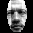
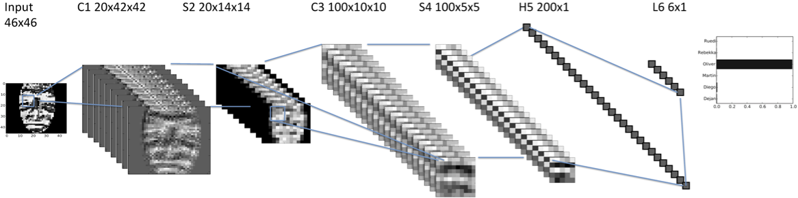
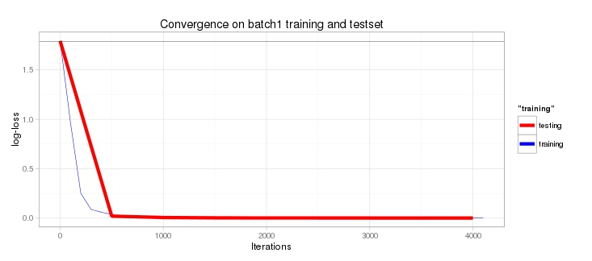

# Experimenting with Caffe 
This notes show how to create a classifier from png-images using caffe from the beginning to end. In this example we used faces, but of course the general workflow stays the same. 

## Creating the images (prerequisite)
Normaly you would already have images, so you could spare this step. But in this git-repository the images are stored in a single file, so in the first step we create the necessary directories and produce the pngs.
```
dueo@srv-lab-t-706:~/dl-playground/python/imageUtils$ ./mkdirs.sh 
dueo@srv-lab-t-706:~/dl-playground/python/imageUtils$ python CreateImages.py 
```
In the local [data directory]('../../data'), you should find a folder called "images"" with two batches of 48x48 images like the one below.



## Creating the lists of images
Now we have two batches of images (batch1 indoor, batch2 taken outdoors). We use batch1 to test the performance and split it into in two parts, one to train the classifier and the other one to evaluate the performance using a test-set. Caffe works on data-layes, these can come from a database (see later) or they can come from lists of files which we now create. We also create a second list of files from batch2 (images taken outdoor) but do not further use them here, where we foccuss on the technical aspects. We create the lists using the following 2 commands:
```
  ~/dl-playground/python/FaceCaffe$ python ../imageUtils/CreateLists.py /home/dueo/dl-playground/data/images/batch1/ names2Numbers.txt batch1_ 0.80
  ~/dl-playground/python/FaceCaffe$ python ../imageUtils/CreateLists.py /home/dueo/dl-playground/data/images/batch2/ names2Numbers.txt batch2_ 1000.0
```
The last entry (0.8, 10000) determines the fraction of the training-set. So from batch1 80% is for training and 20% for testing. In batch 2 we only have one set, which we will use for validation later on. The first lines of batch1_train.txt are:
```
/home/dueo/dl-playground/data/images/batch1/Martin/107.png 2
/home/dueo/dl-playground/data/images/batch1/Rebekka/230.png 4
/home/dueo/dl-playground/data/images/batch1/Martin/137.png 2
/home/dueo/dl-playground/data/images/batch1/Martin/136.png 2
/home/dueo/dl-playground/data/images/batch1/Rebekka/203.png 4
/home/dueo/dl-playground/data/images/batch1/Oliver/154.png 3
/home/dueo/dl-playground/data/images/batch1/Ruedi/281.png 5
/home/dueo/dl-playground/data/images/batch1/Ruedi/255.png 5
/home/dueo/dl-playground/data/images/batch1/Dejan/40.png 0
```
Note that the script ```CreateLists.py``` does a random shuffling. If we would not do this random shuffeling it could be that only images of on person are in a particular mini-batch of the training set.


## Defining the model. 
A model is defined by chaining different layers like convolution layer, max-pooling layer,... together. The principle idea is described in http://caffe.berkeleyvision.org/tutorial/net_layer_blob.html
For the possible different layers see the [tutorial](http://caffe.berkeleyvision.org/tutorial/layers.html#data-layers) or [use the source luke](https://github.com/BVLC/caffe/tree/master/src/caffe/layers). 

We want to build the following architecture:


In the first convolutional layer 20 kernels of size 5×5 were applied resulting in 20 42×42 “images” (C1) from which the maxi- mum of 3×3 neighboring pixels were taken (maxpooling, S2). As a next step, the results were fed into the second convolutional layer (C3) using 100 5×5 filters. Next, a maxpooling (S4) 2×2 was done resulting in 100 5×5 images. These 2500 pixels were then taken as an input for a fully connected hidden layer (H5) with an output of 200 neurons, which was then fed into a multinomial logistic regression with 6 outputs representing the 6 persons.

The model is defined in [prototxt](model/lenet_train_test_files.prototxt). In the following some of the layers are descriped. We begin with the data-layer which, in our case, feeds the images and labels of the training or testset in the pipline.

### The data layer
```
layers {
  name: "Egal"
  type: IMAGE_DATA
  top: "data"
  top: "label"
  image_data_param {
    source: "../batch1_train.txt"
    batch_size: 256
    #shuffle: true
    #new_height: 50
    #new_width: 50
  }
  transform_param {
    scale: 0.00390625  # Image is [0,1] then
    #mirror: 0         # We do not do random rotation, the faces are 
    crop_size: 46      # We randomly crop 46x46
  }
  include: { phase: TRAIN } #These rules apply in the training-phase
}
```

### The other layers
**TODO**

## Training the model
The model could be trained with the following command
```
nohup ~/caffe/caffe/build/tools/caffe train -solver lenet_solver.prototxt -gpu=0 > log_lenet.txt &
```

### The convergence
Using the R-Script [PlotTraining](PlotTraining.R) the log-loss caluclated in the output layer can be investigated. 
We see a rapid convergence. 

Bye the way there used to be an error due to setting `mirror:1` in the testing-phase, which hinderd the model to fit correctly. 

## Inspecting the trained model
We want to have a closer look at the network. We can do so by loading the model in a python session see using [loadingModel.py](loadingModel.py). Using ipython *started from model subdirectory* we step until line 19 as follows:
```
dueo@srv-lab-t-706:~/dl-playground/python/FaceCaffe/model$ ipython
run -d -b 19 ../loadingModel.py
     18   res = net.forward() # this will load the next mini-batch as defined in the net (rewinds)
```
The variable `net` now contains the network, after a forward step using the definition `model/lenet_train_test_files.prototxt` applied to the trained model (containing the weights) `snapshots/lenet25Feb_iter_12000.caffemodel` and the variable `res` the result (the log-loss as given in the model definition).
```
ipdb> res['loss']
array([[[[ 0.00128218]]]], dtype=float32)
```
As seen from the above figure we hava a minimal training loss (since we do an overfitting). Let's have a look at the state of the network after the forward pass. The state of the network is contained in blobs
```
ipdb> net.blobs
OrderedDict([('data', <caffe._caffe.Blob object at 0x4210ed0>), ('label', <caffe._caffe.Blob object at 0x4210a50>), ('conv1', <caffe._caffe.Blob object at 0x42108d0>), ('pool1', <caffe._caffe.Blob object at 0x42107d0>), ('conv2', <caffe._caffe.Blob object at 0x4210e50>), ('pool2', <caffe._caffe.Blob object at 0x85a4050>), ('ip1', <caffe._caffe.Blob object at 0x85a40d0>), ('ip2', <caffe._caffe.Blob object at 0x85a41d0>), ('loss', <caffe._caffe.Blob object at 0x85a4250>)])
```
The input-data is given in the blob `data`
```
ipdb> data = net.blobs['data'].data
ipdb> type(data)
<type 'numpy.ndarray'>
ipdb> np.shape(data)
(256, 3, 46, 46)
ipdb> np.min(data)
0.0
ipdb> np.max(data)
0.99609375
```
The inspection shows that the data is accessible in python as a numpy array. The shape is 256-images (batches) with 3 color-layers each having 46x46 pixels. The values range from 0 to 1. It's a bit strange that the grayscaled image is read as a colored image. But the 3 color layers seem to have the same data:
```
ipdb> np.max(np.abs(data[0,0,:,:] - data[0,1,:,:]))
0.0
ipdb> np.max(np.abs(data[0,0,:,:] - data[0,2,:,:]))
0.0
```
We can store the image again using openCV as follows
```
ipdb> cv2.imwrite('../imgs/first.png', data[0,0,:,:]*256)
```
The image is shown . TODO it seem's that no random cropping happens

### Other blobs
The other blobs contain output and intermediate data. 

### Recalculating the log-loss and the accuracy.
We now compare the result of the softmax-layer `SOFTMAX_LOSS` with the output of the final logistics layer (`ip2`). The relevante lines of [loadingModel.py](loadingModel.py) are:
```
  preds = net.blobs['ip2'].data 
  batchSize = np.shape(preds)[0]
  yTrues = np.reshape(net.blobs['label'].data, batchSize).astype(int) #True Labels (passed from the data layer)
  sumLogLoss = 0
  acc = 0
  for i,yTrue in enumerate(yTrues):
    pred = np.reshape(preds[i], 6) #Output of the final layer (no activation function)
    prob = np.exp(pred)/np.sum(np.exp(pred)) #Calculate the activation function
    print(str(i) + " " + str(prob[yTrue]) + " yTrue " + str(yTrue) + " pred " + str(np.argmax(prob)))
    sumLogLoss -= np.log(prob[yTrue])
    acc += (np.argmax(prob) == yTrue)
  print("Calculated  logloss()" + str(sumLogLoss/batchSize) + "  acc=" + str(acc / batchSize) + " logloss(caffe layer)=" + str(logloss))
```
In detail:

* `batchSize = np.shape(preds)[0]` the batch size is evaluated
*  `yTrues = np.reshape(net.blobs['label'].data, batchSize).astype(int)` #True Labels (passed from the data layer)
* `pred = np.reshape(preds[i], 6)` is the result of the final layer no Soft-max has been applied, which is than calculated by hand.

## Visualizing the weight
See http://nbviewer.ipython.org/github/BVLC/caffe/blob/master/examples/filter_visualization.ipynb 
```
net.params['conv1'][0].data
```


## Evaluating on batch2
This can be done with the same script, but one has to change in the `phase: TEST` the pointer to the file which contains all the examples of batch2. Further one has to set `caffe.set_phase_test()` in around [here](https://github.com/Oliver4242/dl-playground/blob/master/python/FaceCaffe/loadingModel.py#15). The performance drops considerably, which is due to the changes in the lighting, but that's a [different storry](readme_batch2.md). 


